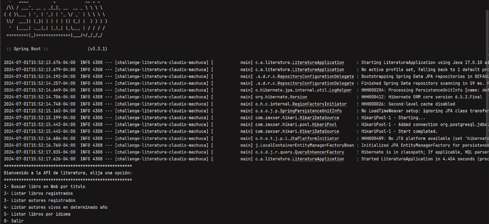

# Desafio LiterAlura

Este proyecto es una aplicación de gestión de libros y autores, desarrollado como parte del desafío de Alura.

## Descripción

Desafio LiterAlura es una aplicación de (Consola) para gestionar información de libros y autores. Permite buscar libros en una API externa, almacenar la información en una base de datos, y realizar consultas sobre los libros y autores registrados.

## Funciones de la aplicacion 

- Buscar libros en una API externa
- Almacenamiento de libros y autores en una base de datos PostgreSQL
- Listar libros registrados
- Listar autores registrados
- Listar autores vivos en un determinado año
- Listar libros por idioma 

## Buscar libro y guardarlo

- [Java JDK 11+](https://www.oracle.com/java/technologies/javase-jdk11-downloads.html)
- [Maven](https://maven.apache.org/install.html)
- [PostgreSQL](https://www.postgresql.org/download/)

###End
